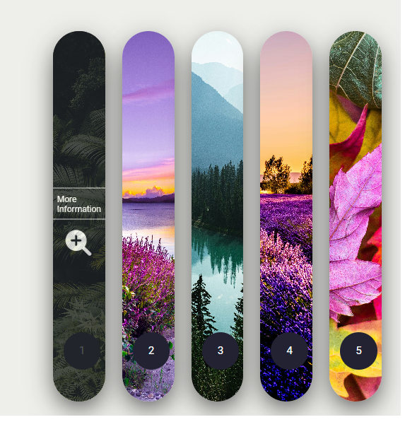

# Card-Animation
[Demo](https://ummahanakancardanimation.netlify.app/)

## Project Overview
- This project has been developed to create a user-friendly and responsive platform using the flexbox structure and the position property. Flexbox features are utilized to flexibly arrange the content of the page, while the position property is employed to place content in desired locations. This combination aims to provide users with an easily accessible and visually appealing experience.
